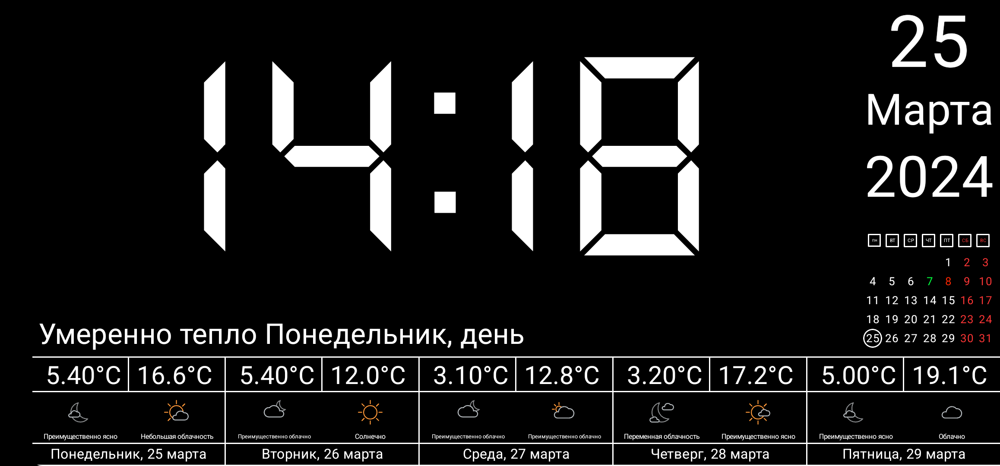
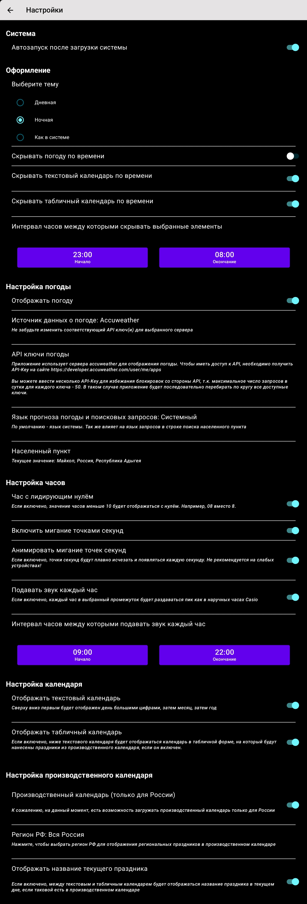

# Мультиплатформенное приложение цифровых часов с погодой и производственным календарём

For english-speak users please use [Readme_en.MD](README_en.MD)

Идея создать такое приложение возникла достаточно давно, т.к. дома копится много устаревшей техники,
которую жалко выбросить, потому что она все еще работает. Так почему же не повесить какой-нибудь
старый планшет на стенку, чтобы он выводил полезную информацию?

## Поддерживаемые платформы

- Android API 21+
- Apple. iOS, iPadOS, macOS (версия для iPad), VisionOS
- JVM Desktop. Windows, macOS, Linux

## Для разработки приложения использовались следующие технологии:

- Поход в сеть за погодой и производственным календарём.
  Использовался [ktor-client](https://ktor.io/docs/getting-started-ktor-client.html)
- Кэширование данных о календаре и погоде в
  БД. [SqlDelight](https://cashapp.github.io/sqldelight/2.0.1/multiplatform_sqlite/)
- Локализованные строки для русского и английского языков, шрифты и raw
  файлы. [ComposeMultiplatformResources](https://www.jetbrains.com/help/kotlin-multiplatform-dev/compose-images-resources.html#setup) (
  Alpha)
- Асинхронная загрузка изображений. [Kamel](https://github.com/Kamel-Media/Kamel)
- Навигация. [Voyager](https://github.com/adrielcafe/voyager)
- kotlinx.serialization
- kotlinx.datetime
- kotlinx.coroutines
- DI построен на [Koin](https://insert-koin.io/docs/reference/koin-compose/multiplatform/)
- Хранение настроек с помощью [Kstore](https://github.com/xxfast/KStore)
- Для JVM Desktop использовалась библиотека [VLC for JAVA](https://github.com/caprica/vlcj)
- Работа с файлами осуществлялась с помощью expect/actual. На Android и iOS реализация нативная, а
  вот для JVM использовалась библиотека [Java AppDirs](https://github.com/harawata/appdirs)

#### Хоть оно достаточно простое, но это моё первое приложение подобного рода, где я сразу изучил как Compose, так и мультиплатформу в целом, и смог связать с ней разные технолгии, необходиме для разработки подобного приложения.

#### Надеюсь, что этот проект поможет многим начинающим с некоторыми трудностями, с которыми они непременно столкнуться в такой молодой штуке, как Compose Multiplatform.

## Чтобы оценить возможности приложения, достаточно взглянуть на скриншот настроек, которые вызываются по клику на часы:

## Чтобы запустить приложение на соответствующей платформе, воспользуйтесь официальной инструкцией KMM
### Android
To run the application on android device/emulator:  
 - open project in Android Studio and run imported android run configuration

To build the application bundle:
 - run `./gradlew :composeApp:assembleDebug`
 - find `.apk` file in `composeApp/build/outputs/apk/debug/composeApp-debug.apk`

### Desktop
Run the desktop application: `./gradlew :composeApp:run`

### iOS
To run the application on iPhone device/simulator:
 - Open `iosApp/iosApp.xcproject` in Xcode and run standard configuration
 - Or use [Kotlin Multiplatform Mobile plugin](https://plugins.jetbrains.com/plugin/14936-kotlin-multiplatform-mobile) for Android Studio

