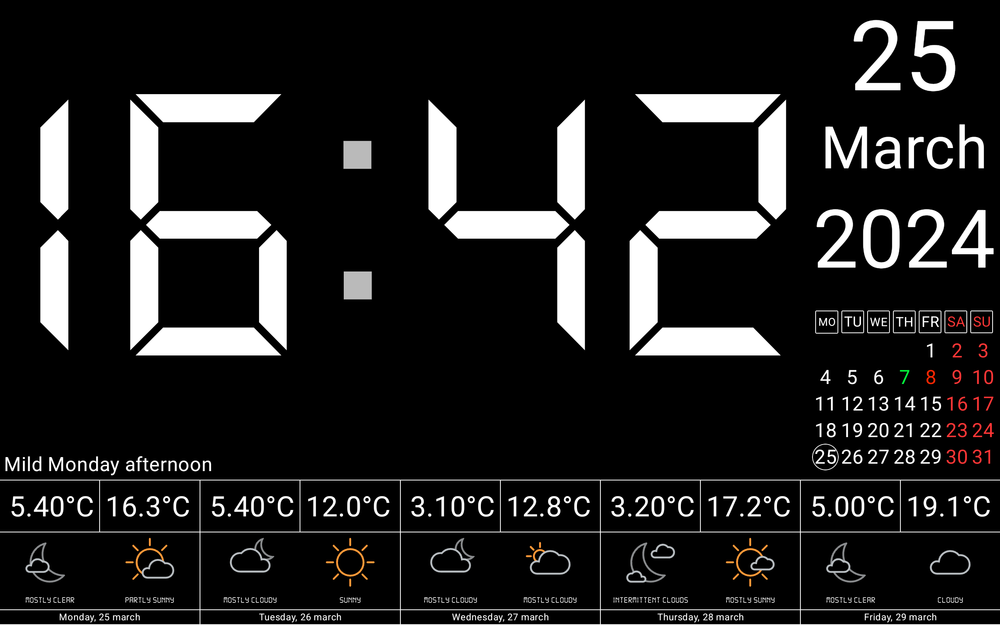

# Multi-platform digital clock app with weather and work calendar

Для русскоговорящих есть [Readme_ru.MD](README.MD)

The idea to create such an application arose quite a long time ago, because... At home there is a
lot of outdated equipment that is a pity to throw away because it still works. So why not hang some
old tablet on the wall so that it displays useful information?

## Supported platforms

- Android API 21+
- Apple. iOS, iPadOS, macOS (iPad version), VisionOS
- JVM Desktop. Windows, macOS, Linux

## To develop the application the following technologies were used:

- Online for the weather and working calendar.
  Used [ktor-client](https://ktor.io/docs/getting-started-ktor-client.html)
- Caching calendar and weather data in the
  database. [SqlDelight](https://cashapp.github.io/sqldelight/2.0.1/multiplatform_sqlite/)
- Localized strings for Russian and English languages, fonts and raw
  files. [ComposeMultiplatformResources](https://www.jetbrains.com/help/kotlin-multiplatform-dev/compose-images-resources.html#setup) (
  Alpha)
- Async image loading. [Kamel](https://github.com/Kamel-Media/Kamel)
- Navigation. [Voyager](https://github.com/adrielcafe/voyager)
- kotlinx.serialization
- kotlinx.datetime
- kotlinx.coroutines
- DI with [Koin](https://insert-koin.io/docs/reference/koin-compose/multiplatform/)
- Store settings with [Kstore](https://github.com/xxfast/KStore)
- For JVM Desktop used library [VLC for JAVA](https://github.com/caprica/vlcj)
- The files were worked with using expect/actual. On Android and iOS the implementation is native,
  but for the JVM the [Java AppDirs](https://github.com/harawata/appdirs) library was used

#### Although it is quite simple, this is my first application of this kind, where I immediately learned both Compose and the multiplatform as a whole, and was able to associate with it various technologies necessary to develop such an application.

#### I hope that this project will help many beginners with some of the difficulties that they will certainly encounter in such a new thing as Compose Multiplatform.

## To evaluate the capabilities of the application, just look at the screenshot of the settings that are called up by clicking on the clock:

## To run the application on the appropriate platform, use the official KMM instructions

### Android

To run the application on android device/emulator:

- open project in Android Studio and run imported android run configuration

To build the application bundle:

- run `./gradlew :composeApp:assembleDebug`
- find `.apk` file in `composeApp/build/outputs/apk/debug/composeApp-debug.apk`

### Desktop

Run the desktop application: `./gradlew :composeApp:run`

### iOS

To run the application on iPhone device/simulator:

- Open `iosApp/iosApp.xcproject` in Xcode and run standard configuration
- Or
  use [Kotlin Multiplatform Mobile plugin](https://plugins.jetbrains.com/plugin/14936-kotlin-multiplatform-mobile)
  for Android Studio

